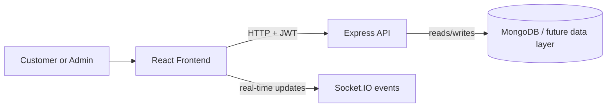

# Architecture Spine — Movie Booking

## Design Paradigm

This project uses a layered client-server pattern: a React + Redux frontend owns presentation, local feature state, and user interaction; an Express API owns business rules, authorization, and data access boundaries; and a future MongoDB layer stores canonical state. This fits a learning project because the responsibilities are simple to teach and easy to split into small backend and frontend units without cross-contamination.



## Invariants & Rules

### AD-1 — Separate client and server ownership

- **Binds:** all
- **Prevents:** UI and API logic drifting into each other, duplicated business rules, fragile front-end-only state
- **Rule:** The frontend must not access the database directly. It may only call backend routes, and the backend is the only place that decides what is valid, authorized, and persisted.

### AD-2 — Movie catalog and showtime data are backend-owned

- **Binds:** movie.discovery, theatre.showtime
- **Prevents:** each frontend screen inventing its own catalog state or stale inventory
- **Rule:** Movie, theatre, screen, and showtime data is fetched from backend endpoints and treated as authoritative. The frontend may cache state but cannot become the source of truth.

### AD-3 — Seat selection and booking confirmation are validated in the backend

- **Binds:** customer.booking, seat.selection, admin.inventory
- **Prevents:** double-booked seats, inconsistent seat availability, and invalid bookings created from client-only assumptions
- **Rule:** Seat availability, booking creation, and confirmation must be validated server-side before a booking is accepted. The client shows current availability, but the backend decides whether the reservation is valid.

### AD-4 — Authenticated routes enforce role boundaries

- **Binds:** customer.profile, customer.booking, admin.catalog, admin.inventory
- **Prevents:** customer actions reaching admin functions and unauthorized mutation of protected resources
- **Rule:** JWT-based authentication is required for protected routes, and admin-only routes must enforce a role check before they execute.

### AD-5 — Feature state is partitioned by domain slice

- **Binds:** frontend state, movie, cart, seat, admin
- **Prevents:** cross-feature state mutation, hidden coupling, and untraceable UI bugs
- **Rule:** State slices stay aligned to domain concerns: movies, selected movie, seats, cart/booking flow, and admin management. Shared state is introduced only when multiple features genuinely need the same data.

## Consistency Conventions

| Concern | Convention |
| --- | --- |
| Naming (entities, files, interfaces, events) | Use domain nouns and clear verbs: `movie`, `showtime`, `seat`, `booking`, `admin`, `customer`; avoid UI-only naming in API contracts. |
| Data & formats | Use consistent IDs, ISO date strings, and standardized response envelopes such as `{ data, error, message }` where needed. |
| State & cross-cutting | Centralize auth checks, validation errors, and API errors at the boundary; frontend stores only UI-ready state and not raw business secrets. |

## Stack

| Name | Version |
| --- | --- |
| React | 19.2.8 |
| Vite | 8.2.2 |
| Redux Toolkit | 2.12.0 |
| React Router | 7.18.2 |
| TypeScript | ~6.0.2 (frontend) / 7.0.2 (backend) |
| Express | 5.2.1 |
| Socket.IO | 4.8.3 |
| MongoDB | planned (not yet implemented) |

## Structural Seed

```text
Movie-Booking/
├─ Movie-Booking-frontend/
│  ├─ src/
│  │  ├─ app/
│  │  ├─ components/
│  │  │  ├─ Header
│  │  │  ├─ MovieCard
│  │  │  ├─ MovieDetails
│  │  │  ├─ SeatBooking
│  │  │  └─ Cart
│  │  ├─ features/
│  │  │  ├─ movie/
│  │  │  ├─ seat/
│  │  │  └─ cart/
│  │  ├─ data/
│  │  ├─ hooks/
│  │  ├─ App.tsx
│  │  └─ main.tsx
│  └─ package.json
├─ Movie-Booking-backend/
│  ├─ src/
│  │  ├─ routes/
│  │  │  └─ moviesRoute.ts
│  │  ├─ data/
│  │  └─ server.ts
│  └─ package.json
├─ _bmad-output/
│  └─ planning-artifacts/
│     ├─ prds/
│     └─ architecture/
└─ docs/
```

## Capability → Architecture Map

| Capability / Area | Lives in | Governed by |
| --- | --- | --- |
| Movie discovery | `Movie-Booking-frontend/src/features/movie` + backend movie routes | AD-1, AD-2 |
| Theater and showtime lookup | backend API, future theater service | AD-2 |
| Seat selection | frontend seat slice + backend seat validation | AD-3 |
| Booking creation | backend booking endpoint + frontend booking flow | AD-3 |
| User auth | backend auth middleware + frontend route guards | AD-4 |
| Admin CRUD | backend admin routes + admin UI section | AD-1, AD-4 |

## Deferred

- Payment integration is intentionally deferred; it is a domain boundary change and not needed for the MVP learning flow.
- Real-time seat lock behavior is deferred until concurrency and multi-user conflict handling are required.
- MongoDB models and schema migrations are deferred until the app moves beyond the mock/in-memory seed mode.
- Advanced analytics, notifications, and cancellation/refund flows are deferred because they are not required to prove the core booking loop.

## Recommended Next Step

The next design step is to turn this spine into a concrete backend schema and route map, then split the frontend into a stable domain structure for movies, seats, cart, and admin panels. This keeps the project consistent while still staying beginner-friendly.
